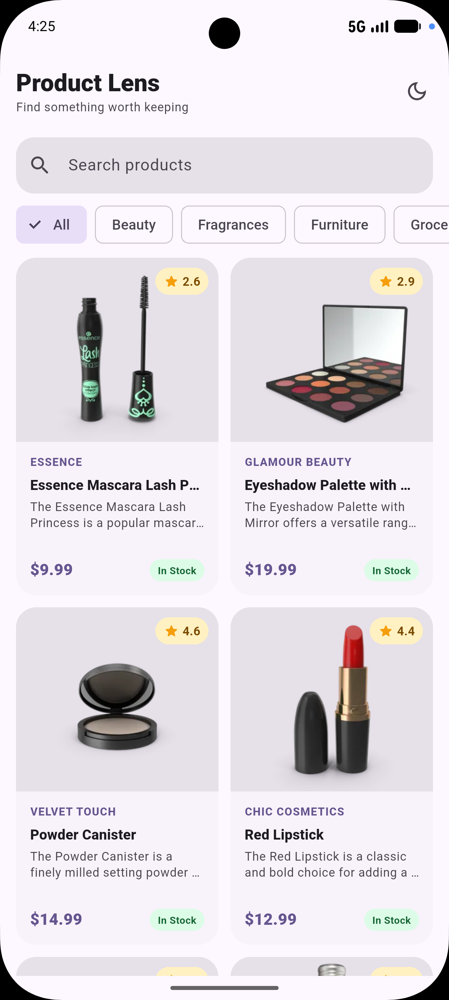
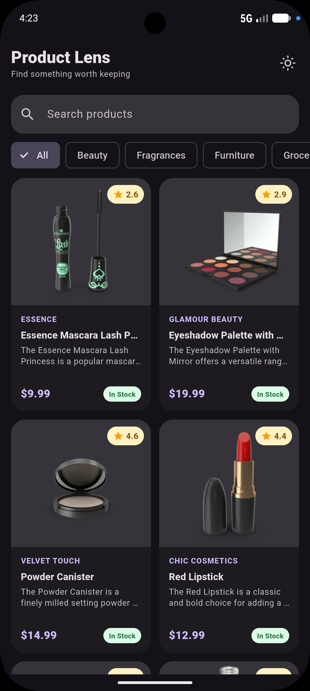
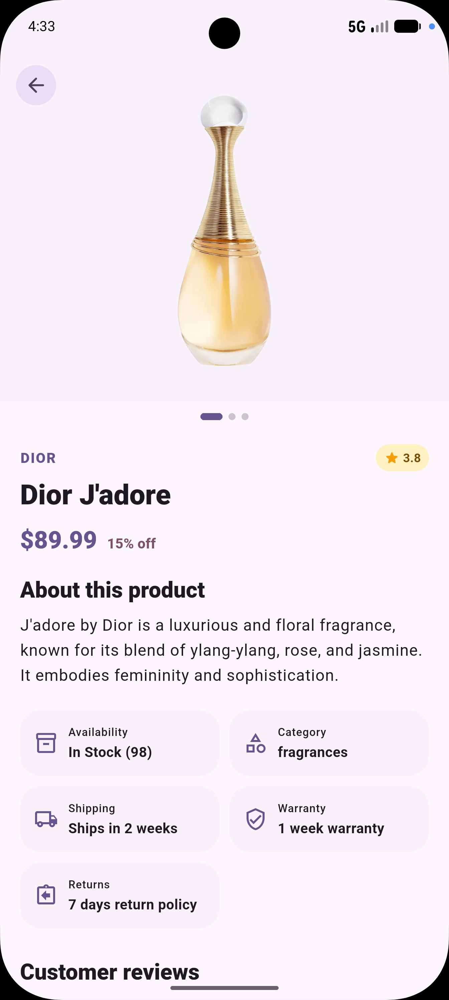

# Product Lens

A small Flutter app that shows products from the [DummyJSON](https://dummyjson.com/docs/products) API. I built it for the Mobile Application Developer remote assessment.

You can browse a list of products, search and filter them, and open any product to see its details.

## Screenshots

| Product list (light) | Product list (dark) | Product detail |
|---|---|---|
|  |  |  |

## What it does

**Product list**!
- Shows the thumbnail, title, description, brand, price and rating for each product
- Shows "In Stock" or "Out of Stock" based on the `stock` value (in stock if stock > 0)
- Loads more products as you scroll (pagination with `limit` and `skip`)
- Search bar (waits a moment after you stop typing before it calls the API)
- Category chips to filter the list
- Pull to refresh, loading skeletons, and a retry button if a request fails

**Product detail**
- Fetches the product from `/products/{id}`
- Shows title, description, price and all the product images (swipe through them)
- Shows customer reviews from the API (falls back to a placeholder if there are none)
- Shows the product QR code

**Other**
- Light and dark mode, and the choice is saved
- Products you have already loaded are cached, so the app can still show them offline

## APIs used

- `GET https://dummyjson.com/products?limit=&skip=`
- `GET https://dummyjson.com/products/{id}`
- `GET https://dummyjson.com/products/search?q=`
- `GET https://dummyjson.com/products/category/{category}`
- `GET https://dummyjson.com/products/category-list`

## Project structure

```
lib/
  models/        Product and page models
  services/      API calls and caching
  repositories/  Repository interface
  providers/     State (Provider / ChangeNotifier)
  screens/       Product list and detail screens
  widgets/       Reusable widgets (product card, rating badge, etc.)
  navigation/    Routes (go_router)
  core/          Themes and config
  di/            Where the app's objects are created
  main.dart
```

I used **Provider** for state management and the **http** package for API calls.

## How to run

1. Install [Flutter](https://docs.flutter.dev/get-started/install). I used version `3.47.4`.
2. Start an emulator or connect a phone.
3. In the project folder, run:

```bash
flutter pub get
flutter run
```

To run the tests:

```bash
flutter test
```
